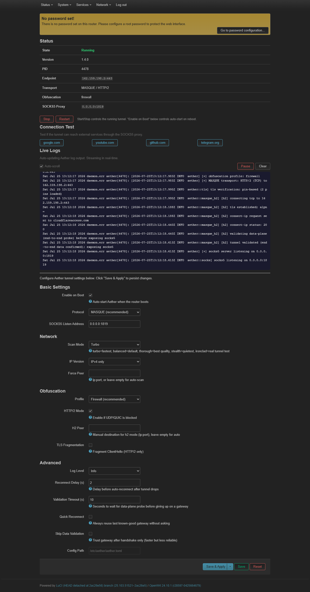

[فارسی](README-fa.md) | [English](README.md)

# Aether OpenWrt Client

اینتگریشن OpenWrt برای [Aether](https://github.com/CluvexStudio/Aether) — یک کلاینت دور زدن سانسور.

**Aether توسط [CluvexStudio](https://github.com/CluvexStudio) توسعه داده می‌شود. این ریپو یک نصب‌کننده OpenWrt و رابط وب LuCI فراهم می‌کند.**

## پیش‌نیازها

- **OpenWrt 24.10 یا جدیدتر** (musl libc؛ apk روی 25.12+، opkg روی 24.10 و قدیمی‌تر)
- تست شده روی OpenWrt 25.12.5 (x86_64)
- ~10 MB فضای دیسک آزاد
- معماری‌ها: x86_64، arm64 (aarch64)، armv7

## نصب (یک خط)

```sh
wget -qO /tmp/aether-install.sh https://raw.githubusercontent.com/moein8668-git/aether-openwrt-client/main/install.sh && chmod +x /tmp/aether-install.sh && /tmp/aether-install.sh --start
```

در حین نصب از شما پرسیده می‌شود:

- **curl نصب شود؟** به صورت پیش‌فرض **خیر**. curl فقط برای دکمه‌های تست اتصال در LuCI لازم است و فضای ذخیره‌سازی اشغال می‌کند. بدون آن تونل همچنان کار می‌کند. اگر قابلیت تست می‌خواهید `y` بزنید.

## این اسکریپت چه کاری انجام می‌دهد

1. معماری روتر شما را به صورت خودکار تشخیص می‌دهد (x86_64، arm64، armv7)
2. آخرین فایل باینری رسمی Aether را از [ریلیزهای CluvexStudio/Aether](https://github.com/CluvexStudio/Aether/releases) دانلود می‌کند
3. سرویس Aether (procd)، ابزار CLI، و رابط وب LuCI را نصب می‌کند
4. فایل‌های پشتیبانی (اسکریپت init، اپ LuCI، CLI، کانفیگ) را از GitHub دانلود می‌کند

## قابلیت‌ها

- **CLI**: `aether-ctl start|stop|restart|status|show|log|test <host>`
- **LuCI**: Services -> Aether
  - جدول وضعیت (وضعیت، نسخه، endpoint، transport، آدرس SOCKS5)
  - دکمه‌های Start / Stop / Restart
  - دکمه‌های تست اتصال با زمان‌بندی دقیق میلی‌ثانیه
  - لاگ‌های زنده بلادرنگ (به‌روزرسانی خودکار، توقف/ادامه، اسکرول خودکار)
  - پیکربندی کامل (پروتکل، حالت اسکن، obfuscation، HTTP/2 و غیره)
- **سرویس**: ادغام procd، شروع خودکار هنگام بوت
- **معماری**: x86_64، arm64، armv7 (باینری‌های استاتیک musl)

## گزینه‌های نصب

```sh
/tmp/aether-install.sh                 # فقط نصب
/tmp/aether-install.sh --start         # نصب و شروع فوری
/tmp/aether-install.sh --force-config  # بازنویسی کانفیگ موجود
/tmp/aether-install.sh --no-curl       # رد شدن از پرامپت نصب curl
```

## حذف نصب

```sh
./uninstall.sh           # حذف فایل‌ها
./uninstall.sh --purge   # حذف کانفیگ و داده‌های هویت نیز
```

## دستورات CLI

```sh
aether-ctl start
aether-ctl stop
aether-ctl restart
aether-ctl status
aether-ctl show
aether-ctl log              # نمایش لاگ‌های اخیر
aether-ctl log 100          # نمایش 100 خط آخر
aether-ctl test google.com  # تست اتصال از طریق تونل (نیاز به curl)
aether-ctl version
```

## رابط وب LuCI

پس از نصب، رابط وب روتر خود را باز کنید -> **Services -> Aether**



قابلیت‌ها:
- جدول وضعیت (وضعیت، نسخه، endpoint، transport)
- دکمه‌های Start / Stop / Restart
- دکمه‌های تست اتصال (google.com، youtube.com، github.com، telegram.org) با زمان دقیق ms
- لاگ‌های زنده بلادرنگ (به‌روزرسانی خودکار هر 2 ثانیه، بدون نیاز به رفرش دستی)
- توقف/ادامه استریم لاگ
- تاگل اسکرول خودکار
- دکمه پاک کردن لاگ‌ها
- پیکربندی کامل (پروتکل، حالت اسکن، obfuscation، HTTP/2 و غیره)

## به‌روزرسانی دستی (از کامپیوتر شما)

اگر ریپو را به صورت محلی کلون کرده‌اید و می‌خواهید فایل‌های به‌روزرسانی شده را بدون عبور از GitHub به روتر خود منتقل کنید:

```sh
# ایجاد آرشیو از دایرکتوری files
cd aether-openwrt-client
tar czf /tmp/aether-files.tar.gz files/

# انتقال به روتر (OpenWrt سرور scp ندارد، از wget در روتر استفاده کنید)
# در کامپیوتر شما، فایل را موقتاً سرو کنید:
python -m http.server 8888 --directory /tmp

# در روتر:
wget -O /tmp/aether-files.tar.gz http://<your-pc-ip>:8888/aether-files.tar.gz
tar xzf /tmp/aether-files.tar.gz -C /
/etc/init.d/aether restart
/etc/init.d/rpcd restart
```

یا فقط اسکریپت نصب را دوباره اجرا کنید (همیشه آخرین فایل‌ها را از GitHub دانلود می‌کند):

```sh
wget -qO /tmp/aether-install.sh https://raw.githubusercontent.com/moein8668-git/aether-openwrt-client/main/install.sh && chmod +x /tmp/aether-install.sh && /tmp/aether-install.sh --start
```

## نکات

- نیاز به OpenWrt 24.10+ با musl libc (apk روی 25.12+، opkg روی قدیمی‌تر)
- `curl` اختیاری است (در حین نصب پرسیده می‌شود، به صورت پیش‌فرض خیر). فقط برای دکمه‌های تست اتصال LuCI لازم است.
- این پروژه وابسته به CluvexStudio نیست

## مجوز

MIT — فقط این نصب‌کننده و اپ LuCI. خود Aether تحت AGPL-3.0 است.
